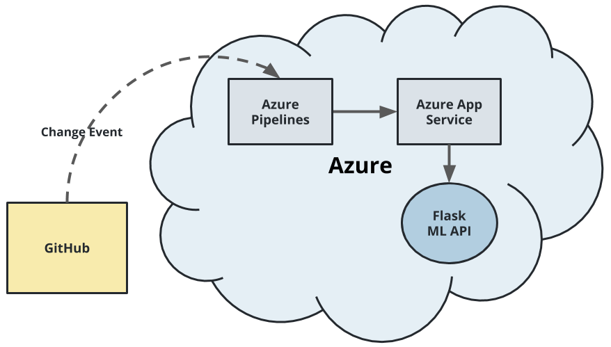

# Overview

<TODO: complete this with an overview of your project>
create a scaffolding that will assist you in performing both Continuous Integration and Continuous Delivery. You'll use Github Actions along with a Makefile, requirements.txt and application code to perform an initial lint, test, and install cycle. Next, you'll integrate this project with Azure Pipelines to enable Continuous Delivery to Azure App Service.

You are given a pre-trained, sklearn model that has been trained to predict housing prices in Boston according to several features, such as average rooms in a home and data about highway access, teacher-to-pupil ratios, and so on. If you're curious, you can read more about the data, which was initially taken from Kaggle, on the data source site. This project tests your ability to operationalize a Python flask app—in a provided file, app.py—that serves out predictions (inference) about housing prices through API calls. This project could be extended to any pre-trained machine learning model, such as those for image recognition and data labeling.

Documentation:
https://docs.microsoft.com/en-us/azure/devops/pipelines/ecosystems/python-webapp?view=azure-devops

## Project Plan
<TODO: Project Plan

* A link to a Trello board for the project
* A link to a spreadsheet that includes the original and final project plan>
* [Project Plan](/docs/ProjectPlan.xlsx)

## Instructions
Below you'll find an high-level architecture of what this project consists of:

Source: Image taken from Udacity Course "DevOps Engineer for Microsoft Azure"

<TODO:  Instructions for running the Python project.  How could a user with no context run this project without asking you for any help.  Include screenshots with explicit steps to create that work. Be sure to at least include the following screenshots:

### Project Set-Up

1. Cloning

2. Make all


3. Example of an unsuccessful test-run


* Project running on Azure App Service

* Project cloned into Azure Cloud Shell

* Passing tests that are displayed after running the `make all` command from the `Makefile`

* Output of a test run

* Successful deploy of the project in Azure Pipelines.  [Note the official documentation should be referred to and double checked as you setup CI/CD](https://docs.microsoft.com/en-us/azure/devops/pipelines/ecosystems/python-webapp?view=azure-devops).

* Running Azure App Service from Azure Pipelines automatic deployment

* Successful prediction from deployed flask app in Azure Cloud Shell.  [Use this file as a template for the deployed prediction](https://github.com/udacity/nd082-Azure-Cloud-DevOps-Starter-Code/blob/master/C2-AgileDevelopmentwithAzure/project/starter_files/flask-sklearn/make_predict_azure_app.sh).
The output should look similar to this:

```bash
udacity@Azure:~$ ./make_predict_azure_app.sh
Port: 443
{"prediction":[20.35373177134412]}
```

* Output of streamed log files from deployed application

> 

## Enhancements

<TODO: A short description of how to improve the project in the future>

## Demo 

<TODO: Add link Screencast on YouTube>


