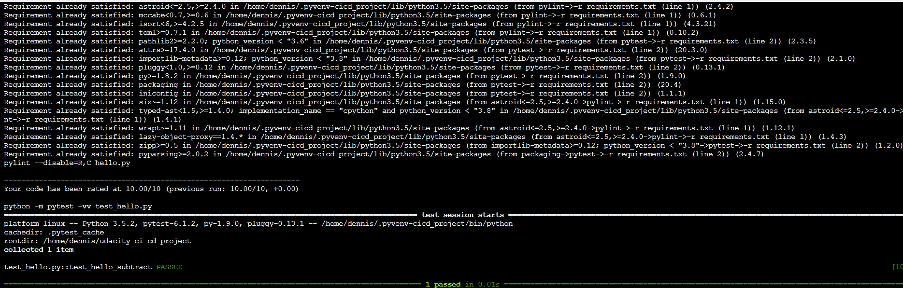

# Overview

In this project we created a a Continuous Integration and Continuous Delivery chain from scratch.   
We used `Github Actions` along with a Makefile, requirements.txt and some basic python code to perform an initial lint, test, and install cycle.  
After having successfully finalized this basic CI/CD chain with `Github Actions`, it was time for some nice integration with `Azure Pipelines`.

For the `Azure Pipelines` integration, we replaced the initial code completely.  
We were given a pre-trained `sklearn` model that predicts housing prices in Boston.

## Project Plan
Below you'll find the links to the Trello Board as wall as the spreadsheet including the project's plan.

* [Trello Board](https://trello.com/b/Pdt6RSCR)
* [Project Plan](/docs/ProjectPlan.xlsx)

## Instructions
Below you'll find an high-level architecture of what this project consists of:

*Source: Image taken from Udacity Course "DevOps Engineer for Microsoft Azure"*

The idea is to create a CI/CD pipeline using `Azure Pipelines`.  
The pipeline should run on every commit to the `master`-branch which is located in a `GitHub` repository.
Purpose of the pipeline is to update the Azure WebApp based on the provided python-code in the repository.

### Project Set-Up (Scaffold)

The following steps show how to set-up the first part of the project:  
A simple python application with CI/CD using GitHub Actions

1. Clone the repository: `git@github.com:Siegbaert/udacity-ci-cd-project.git`

2. Switch to scaffold project folder: `cd scaffold`

3. Create python virtual environment: `python3 -m venv ~/.pyvenv-cicd_project`

4. Source the virtual environment: `source ~/.pyvenv-cicd_project/bin/activate`

5. Run `make all`

6. Modify test to fail and run `make test`:

### Project Set-Up (ML - Boston House Price Prediction)

1. Ensure you're at the root-directory of the repository

2. Create python virtual environment: `python3 -m venv ~/.pyvenv-cicd_project`

3. Source the virtual environment: `source ~/.pyvenv-cicd_project/bin/activate`

4. Upgrade Pip: `python -m pip install --upgrade pip`

5. Install required python modules: `pip install -r requirements.txt`

6. Run the web-app: `az webapp up --sku F1 -n udacity-ci-cd-project-webapp`

7. Make a prediction: `./make_predict_azure_app.sh`

8. Display logs of the web-app: `az webapp log tail`

9. Azure web-app running (Azure Portal)

10. Successful Azure Pipeline Run

## Locust
Locust is a tool for load-testing web-applications.
The created `locustfile.py` contains the necessary code to get predictions by calling the deployed WebApp.

1. Run locust locally: `locust`

2. Go to Locust WebUi: `http://localhost:8089/`

3. Enter Test-Setup: e.g. Users=25, SpawnRate=1, Host: https://udacity-ci-cd-project-webapp.azurewebsites.net:443 

### Screenshots

* Locust running with 1 user:  

* Locust running with 25 user:  

## Enhancements
The following points could done to enhance in this project:

* Separate into different environments (e.g. DEV, INT, PROD)
* Only allow changes to "master" via Pull Requests from a separate branch
* Enforce a policy that branches can only be merged into master if PR is reviewed by at least one additional person
* ...

## Demo 

<TODO: Add link Screencast on YouTube>

